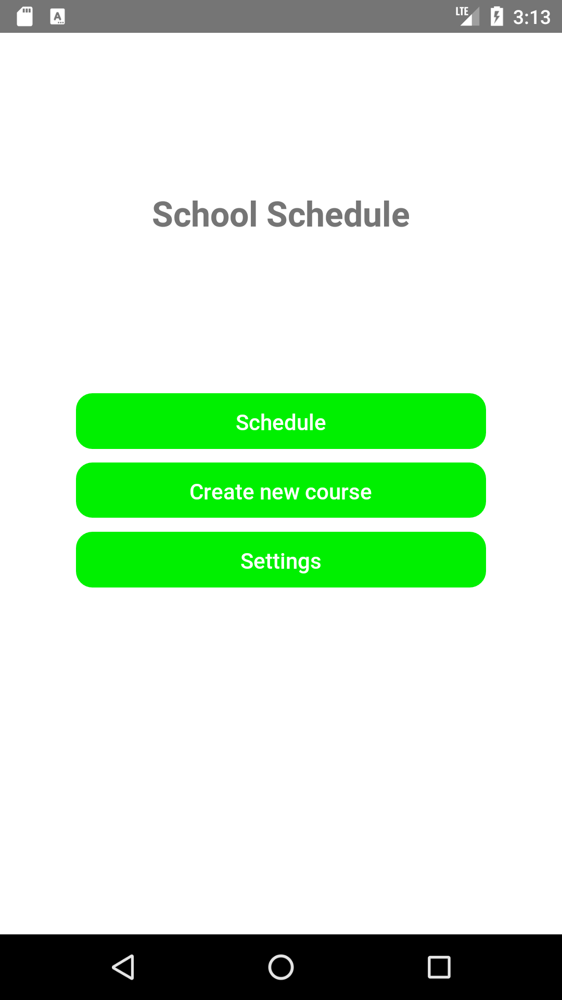
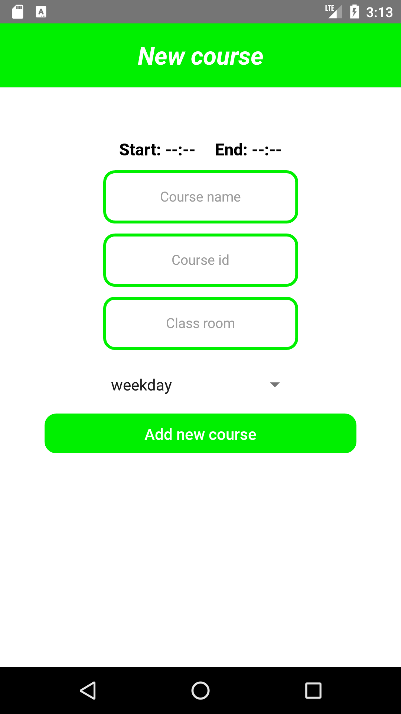
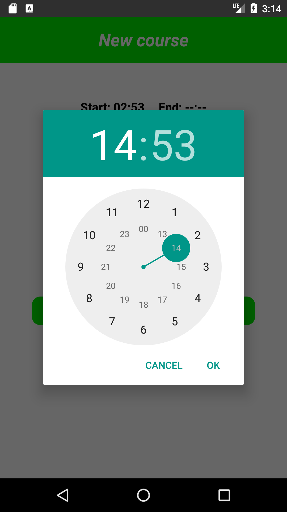
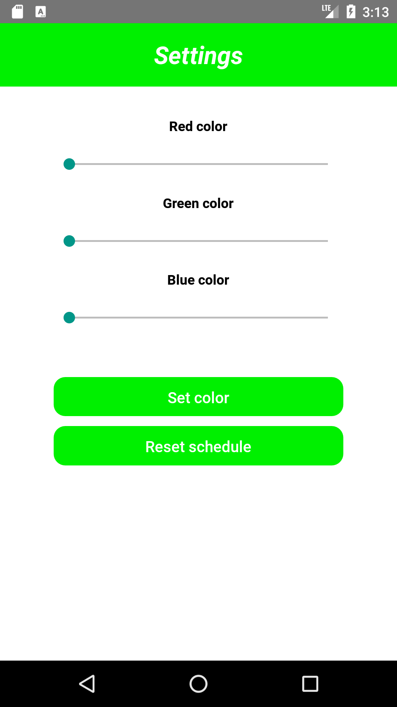
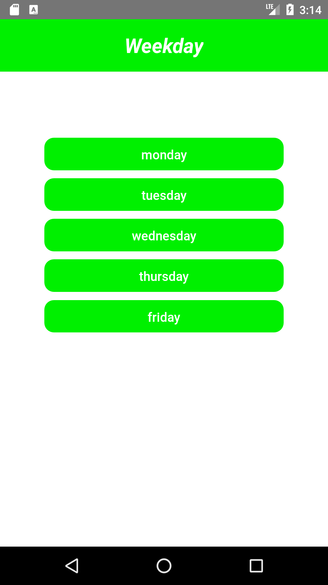
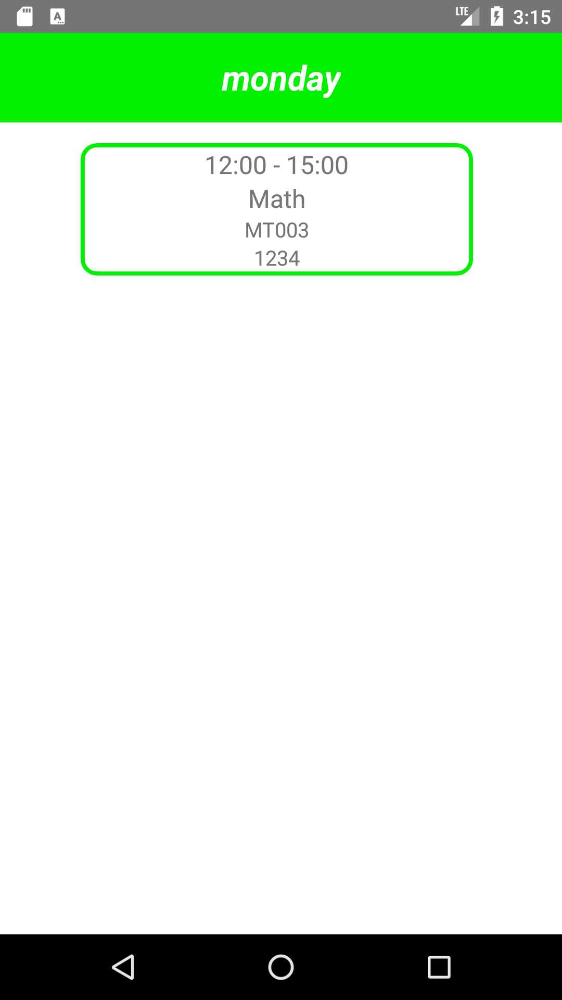

# SchoolSchedule

School schedule mobile application, which is based my previous school course Project repository [MoProject](https://github.com/JuHaNi654/MoProject).
Code has been modified, that it saves courses and styles in to the asyncstorage and fetch them from there.
Also in the settings color style is used with three different slider component that later compines to the rgb color value,
so there will be more option in the selecting color.

### MainScreen.js

### NewTimeStamp.js

### SettingScreen.js

### WeekdayScreen.js

### Selected weekday view. CourseScreen.js

